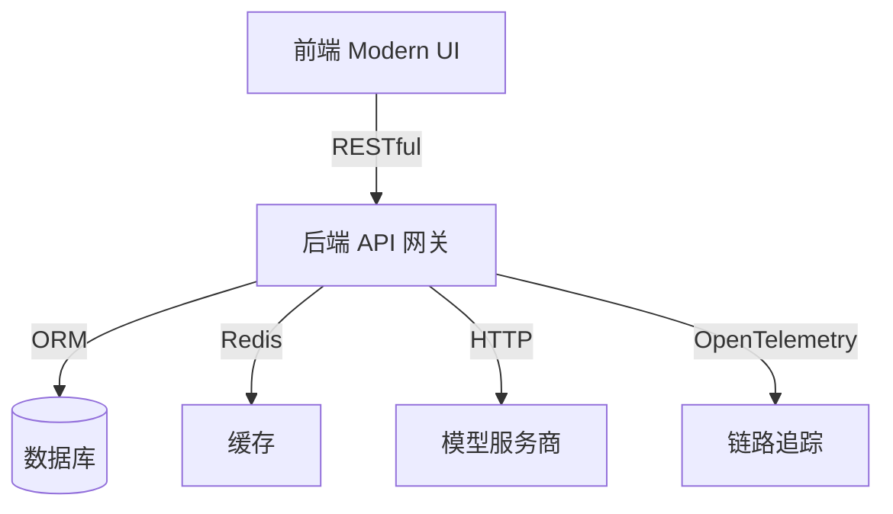

# UniAPI 项目 API & 架构文档

---

## 0. 项目架构与技术栈

**UniAPI** 是现代化的 AI API 网关与管理平台，聚合主流大模型服务商（OpenAI、Anthropic、Google、Azure、DeepSeek、AWS 等），统一支持 ChatCompletion、Response、Claude Messages 等多格式自动转换，支持多租户、分组、配额、API Key 管理、用量计费、可插拔通道与能力。

**主要技术栈：**

- 后端：Go 1.25，Gin，GORM，Zap，MySQL/SQLite，Redis
- 前端：React + TypeScript + Tailwind CSS（Modern 模板）
- 部署：Docker、systemd、K8s 支持

**架构分层：**



**主要目录结构：**

- controller/ 路由与业务逻辑
- model/ 数据结构与 ORM
- relay/ 代理与多格式适配
- web/modern/ 前端源码
- docs/ 文档

---

## 1. API 端点总览

- 用户模块
  - POST /api/user/register —— 用户注册
  - POST /api/user/login —— 用户登录
  - GET /api/user/self —— 获取当前用户信息
  - POST /api/user/update —— 更新用户信息
  - POST /api/user/password —— 修改密码
  - POST /api/user/totp/bind —— 绑定TOTP
  - POST /api/user/totp/verify —— 验证TOTP

- 通道模块
  - GET /api/channel —— 获取通道列表
  - POST /api/channel —— 新建通道
  - PUT /api/channel/{id} —— 更新通道
  - DELETE /api/channel/{id} —— 删除通道

- 日志模块
  - GET /api/log —— 查询调用日志

- Token模块
  - GET /api/token —— 获取API Key列表
  - POST /api/token —— 新建API Key
  - PUT /api/token/{id} —— 更新API Key
  - DELETE /api/token/{id} —— 删除API Key

- 充值模块
  - POST /api/topup —— 充值请求

- 代理/AI接口
  - POST /v1/chat/completions —— OpenAI兼容
  - POST /v1/completions —— OpenAI兼容
  - POST /v1/messages —— Claude兼容
  - POST /v1/responses —— 通用响应格式

> 详细接口说明见下方“接口详情”章节。

---

## 2. 接口详情（全量举例）

---

### 用户注册

**POST /api/user/register**

- 描述：新用户注册
- 请求参数：
  - body: `{ username: string, password1: string, password2: string, email?: string }`
- 请求示例：
  - curl:
    ```bash
    curl -X POST https://yourdomain/api/user/register \
      -H 'Content-Type: application/json' \
      -d '{"username":"test","password1":"12345678","password2":"12345678","email":"test@example.com"}'
    ```
  - axios:
    ```js
    axios.post('/api/user/register', { username: 'test', password1: '12345678', password2: '12345678', email: 'test@example.com' });
    ```
- 响应结构：
  - 成功：
    ```json
    { "success": true, "data": { "id": 1, "username": "test", ... }, "message": "" }
    ```
  - 失败：
    ```json
    { "success": false, "message": "用户名已存在" }
    ```
- 错误码说明：用户名已存在、参数不合法等
- 认证要求：无需认证

---

### 用户登录

**POST /api/user/login**

- 描述：用户登录，支持 TOTP 二次验证
- 请求参数：
  - body: `{ username: string, password: string, totp_code?: string }`
- 请求示例：
  - curl:
    ```bash
    curl -X POST https://yourdomain/api/user/login \
      -H 'Content-Type: application/json' \
      -d '{"username":"test","password":"12345678"}'
    ```
  - axios:
    ```js
    axios.post('/api/user/login', { username: 'test', password: '12345678' });
    ```
- 响应结构：
  - 成功：
    ```json
    { "success": true, "data": { "id": 1, "username": "test", ... }, "message": "" }
    ```
  - 失败：
    ```json
    { "success": false, "message": "用户名或密码错误" }
    ```
- 错误码说明：用户名/密码错误、TOTP 校验失败、账号被禁用等
- 认证要求：无需认证

---

### 获取当前用户信息

**GET /api/user/self**

- 描述：获取当前登录用户信息
- 请求参数：无
- 请求示例：
  - curl:
    ```bash
    curl -H 'Authorization: Bearer <token>' https://yourdomain/api/user/self
    ```
  - axios:
    ```js
    axios.get('/api/user/self', { headers: { Authorization: 'Bearer <token>' } });
    ```
- 响应结构：
  ```json
  { "success": true, "data": { "id": 1, "username": "test", ... }, "message": "" }
  ```
- 错误码说明：未登录、Token 失效
- 认证要求：需要用户 Token

---

### 通道列表

**GET /api/channel**

- 描述：获取所有通道（需管理员权限）
- 请求参数：
  - query: `p`（页码，默认0），`size`（每页数量，默认10），`sort`（排序字段），`order`（asc/desc）
- 请求示例：
  - curl:
    ```bash
    curl -H 'Authorization: Bearer <admin_token>' 'https://yourdomain/api/channel?p=0&size=10'
    ```
  - axios:
    ```js
    axios.get('/api/channel', { params: { p: 0, size: 10 }, headers: { Authorization: 'Bearer <admin_token>' } });
    ```
- 响应结构：
  ```json
  { "success": true, "data": [ { "id": 1, "name": "OpenAI", ... } ], "total": 1 }
  ```
- 错误码说明：无权限、参数错误
- 认证要求：管理员 Token

---

### 日志查询

**GET /api/log**

- 描述：分页查询调用日志
- 请求参数：
  - query: `p`（页码），`size`（每页数量），`token_name`，`model_name`，`start_timestamp`，`end_timestamp`，`type`，`username`，`sort`，`order`
- 请求示例：
  - curl:
    ```bash
    curl -H 'Authorization: Bearer <token>' 'https://yourdomain/api/log?p=0&size=10'
    ```
  - axios:
    ```js
    axios.get('/api/log', { params: { p: 0, size: 10 }, headers: { Authorization: 'Bearer <token>' } });
    ```
- 响应结构：
  ```json
  { "success": true, "data": [ { "id": 1, "user_id": 1, ... } ], "total": 100 }
  ```
- 错误码说明：无权限、参数错误
- 认证要求：用户 Token

---

### Token 新建

**POST /api/token/**

- 描述：新建 API Key
- 请求参数：
  - body: `{ name: string, remain_quota: int, expired_time?: int, models?: string, subnet?: string }`
- 请求示例：
  - curl:
    ```bash
    curl -X POST -H 'Authorization: Bearer <token>' -H 'Content-Type: application/json' \
      -d '{"name":"test-key","remain_quota":10000}' https://yourdomain/api/token/
    ```
  - axios:
    ```js
    axios.post('/api/token/', { name: 'test-key', remain_quota: 10000 }, { headers: { Authorization: 'Bearer <token>' } });
    ```
- 响应结构：
  ```json
  { "success": true, "data": { "id": 1, "key": "sk-xxx", ... }, "message": "" }
  ```
- 错误码说明：配额不足、参数错误
- 认证要求：用户 Token

---

### 充值请求

**POST /api/topup/**

- 描述：用户发起充值请求
- 请求参数：
  - body: `{ amount: int, remark?: string }`
- 请求示例：
  - curl:
    ```bash
    curl -X POST -H 'Authorization: Bearer <token>' -H 'Content-Type: application/json' \
      -d '{"amount":100}' https://yourdomain/api/topup/
    ```
  - axios:
    ```js
    axios.post('/api/topup/', { amount: 100 }, { headers: { Authorization: 'Bearer <token>' } });
    ```
- 响应结构：
  ```json
  { "success": true, "data": { "id": 1, "amount": 100, ... }, "message": "" }
  ```
- 错误码说明：参数错误、配额异常
- 认证要求：用户 Token

---

### AI 代理接口（OpenAI/Claude/通用）

**POST /v1/chat/completions**

- 描述：OpenAI ChatCompletion 兼容接口
- 请求参数：详见 OpenAI 官方文档（支持 messages、model、stream、temperature、top_p、n、stop、max_tokens、user 等）
- 请求示例：
  - curl:
    ```bash
    curl -X POST https://yourdomain/v1/chat/completions \
      -H 'Authorization: Bearer <api-key>' \
      -H 'Content-Type: application/json' \
      -d '{"model":"gpt-3.5-turbo","messages":[{"role":"user","content":"你好"}]}'
    ```
  - axios:
    ```js
    axios.post(
      '/v1/chat/completions',
      { model: 'gpt-3.5-turbo', messages: [{ role: 'user', content: '你好' }] },
      { headers: { Authorization: 'Bearer <api-key>' } }
    );
    ```
- 响应结构：与 OpenAI 官方一致
- 错误码说明：详见下方“错误码与响应结构”
- 认证要求：API Key

**POST /v1/messages**

- 描述：Claude Messages 兼容接口
- 请求参数/响应结构：兼容 Anthropic Claude API

**POST /v1/responses**

- 描述：通用响应格式，支持多模型自动适配
- 请求参数/响应结构：详见 relay/model/message.go

---

## 5. 错误码与响应结构

- 所有接口统一响应结构：
  ```json
  {
    "success": true,
    "data": { ... },
    "message": "",
    "total": 100 // 分页接口
  }
  ```
- 失败示例：
  ```json
  {
    "success": false,
    "message": "错误描述"
  }
  ```
- 常见错误码说明：
  - 401 未认证/Token失效
  - 403 权限不足
  - 404 资源不存在
  - 422 参数错误
  - 429 配额不足/频率超限
  - 500 服务器内部错误
  - 600+ 代理/AI接口错误（详见 data 字段）

---

## 6. 数据库结构说明

**主要表结构（SQLite/MySQL）：**

### users

| 字段                  | 类型        | 说明                                        |
| --------------------- | ----------- | ------------------------------------------- |
| id                    | integer     | 主键，自增                                  |
| username              | text        | 用户名，唯一                                |
| password              | text        | 密码哈希                                    |
| display_name          | text        | 显示名                                      |
| role                  | int         | 角色（0-游客，1-普通，10-管理员，100-root） |
| status                | int         | 状态（1-启用，2-禁用，3-删除）              |
| email                 | text        | 邮箱                                        |
| quota                 | int         | 总配额                                      |
| used_quota            | int         | 已用配额                                    |
| group                 | varchar(32) | 分组                                        |
| access_token          | char(32)    | 管理员 Token                                |
| totp_secret           | varchar(64) | TOTP 二次验证密钥                           |
| mcp_tool_blacklist    | text        | 能力黑名单                                  |
| created_at/updated_at | int         | 时间戳                                      |

### channels

| 字段    | 类型        | 说明                  |
| ------- | ----------- | --------------------- |
| id      | integer     | 主键                  |
| type    | int         | 通道类型              |
| key     | text        | 通道密钥              |
| status  | int         | 状态                  |
| name    | text        | 名称                  |
| models  | text        | 支持模型列表          |
| group   | varchar(32) | 分组                  |
| balance | real        | 余额                  |
| config  | text        | 配置 JSON             |
| ...     | ...         | 详见 model/channel.go |

### tokens

| 字段            | 类型     | 说明           |
| --------------- | -------- | -------------- |
| id              | integer  | 主键           |
| user_id         | integer  | 所属用户       |
| key             | char(48) | Token 值，唯一 |
| status          | int      | 状态           |
| name            | text     | 名称           |
| remain_quota    | int      | 剩余额度       |
| unlimited_quota | bool     | 是否无限额度   |
| expired_time    | int      | 过期时间       |
| models          | text     | 可用模型       |
| subnet          | text     | 可用子网       |

### logs

| 字段       | 类型    | 说明              |
| ---------- | ------- | ----------------- |
| id         | integer | 主键              |
| user_id    | integer | 用户ID            |
| created_at | int     | 时间戳            |
| type       | int     | 日志类型          |
| content    | text    | 内容              |
| token_name | text    | Token 名称        |
| model_name | text    | 模型名            |
| quota      | int     | 消耗额度          |
| ...        | ...     | 详见 model/log.go |

### recharge_requests

| 字段         | 类型    | 说明       |
| ------------ | ------- | ---------- |
| id           | integer | 主键       |
| user_id      | integer | 用户ID     |
| amount       | int     | 充值金额   |
| quota        | int     | 充值额度   |
| status       | int     | 状态       |
| remark       | text    | 备注       |
| admin_remark | text    | 管理员备注 |
| created_time | int     | 创建时间   |

> 其它表结构详见数据库 schema，支持能力扩展、异步任务、MCP 工具、分组池等。

---

## 7. 配置与安装部署说明

### 环境依赖

- Go >= 1.25
- Node.js >= 16
- yarn
- MySQL 或 SQLite
- Redis（可选）

### 安装流程

1. 克隆代码仓库
2. 后端依赖安装与构建：
   ```sh
   go mod tidy
   make build
   ```
3. 前端依赖安装与构建：
   ```sh
   cd web/modern
   yarn install && yarn build
   ```
4. 数据库初始化（如用 MySQL，建库并配置好 DSN）
5. 配置环境变量（见 CONFIG_GUIDE.md）：
   - `PORT` 后端端口

- `SQL_DSN` 数据库连接串（留空时可使用 `SQLITE_PATH`）
- `REDIS_CONN_STRING` Redis 连接串
- `SESSION_SECRET` 管理后台会话密钥
- 其它见 common/config/config.go

6. 启动后端：`./uniapi`
7. 启动前端（静态服务或 yarn dev）

### 生产部署建议

- 推荐使用 Docker 或 systemd 部署
- 支持 K8s，详见 docs/manuals/k8s.md
- 日志与链路追踪支持 OpenTelemetry

---

## 8. 前端调用对照表

| 页面/组件               | 调用接口                                                                                   | 说明                    |
| ----------------------- | ------------------------------------------------------------------------------------------ | ----------------------- |
| 登录页（Login）         | POST /api/user/login                                                                       | 用户登录                |
| 注册页（Register）      | POST /api/user/register                                                                    | 用户注册                |
| 个人中心（Profile）     | GET /api/user/self<br>POST /api/user/update<br>POST /api/user/password                     | 获取/更新用户信息、改密 |
| TOTP 绑定（TOTPBind）   | POST /api/user/totp/bind<br>POST /api/user/totp/verify                                     | 二次验证绑定/校验       |
| 通道管理（ChannelList） | GET /api/channel<br>POST /api/channel<br>PUT /api/channel/{id}<br>DELETE /api/channel/{id} | 通道增删改查            |
| 日志查询（LogList）     | GET /api/log                                                                               | 查询调用日志            |
| Token 管理（TokenList） | GET /api/token<br>POST /api/token<br>PUT /api/token/{id}<br>DELETE /api/token/{id}         | API Key 管理            |
| 充值（Topup）           | POST /api/topup                                                                            | 用户充值                |
| AI 聊天（Chat）         | POST /v1/chat/completions<br>POST /v1/messages<br>POST /v1/responses                       | AI 代理调用             |

> 具体调用逻辑可参考 web/modern/src/lib/services/ 目录下各 API 封装文件。

---

# 文档完结

如需补充其它内容或有格式/细节要求，请随时告知。
